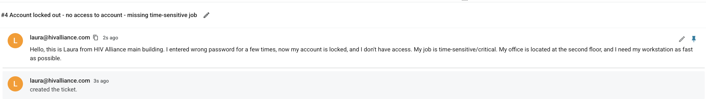
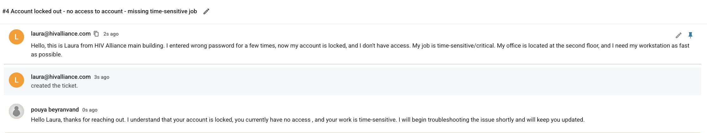
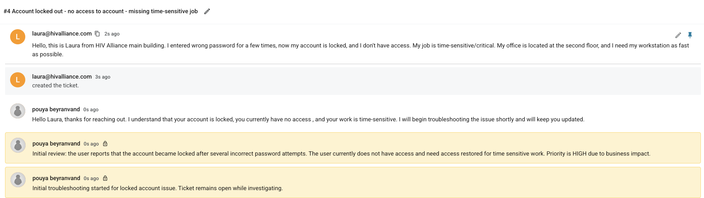
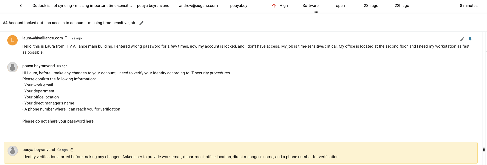
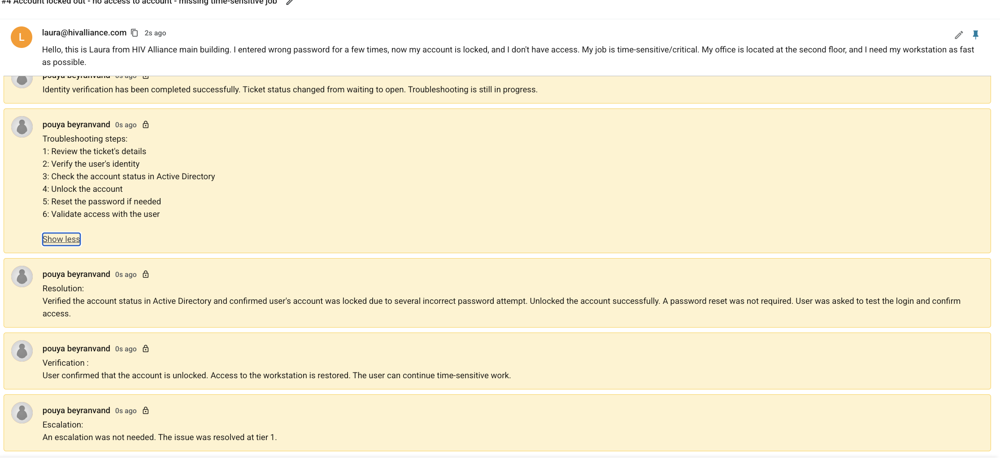

# Lab 02: Account Locked Out / Password Reset Request

# How Do I Document Tickets?

When documenting IT support tickets, I follow a clear structure so other IT Technicians can understand the issue, actions taken, and final outcome.

1. Review the ticket details carefully.
   Ask the user for screenshots, error messages, or additional information if needed.

2. Add internal notes after each important step.
   This helps keep the troubleshooting process clear and easy to follow.

3. Document the troubleshooting steps taken.
   Include what was checked, tested, changed, or confirmed.

4. Write the resolution.
   Explain what fixed the issue.

5. Add verification notes.
   Confirm that the user tested the issue and access or service was restored.

6. Add an escalation note.
   State whether escalation was needed or if the issue was resolved at Tier 1.

The goal is to document each ticket clearly so another IT Technician can understand what happened and continue support if needed.

--- 

## Scenario

A user reported that their account was locked after several incorrect password attempts. The user could not access their workstation and needed access restored quickly because the work was time-sensitive.

## Tools / Platform

- Ticketing System
- Active Directory
- Account Management Concepts

## Focus Areas

- Account lockout support
- Identity verification
- Active Directory account review
- User communication
- Resolution documentation

## Ticket Summary

Issue: Account locked after multiple incorrect password attempts
Priority: High
Impact: User could not access workstation or time-sensitive work
Resolution Level: Tier 1
Escalation: Not required
Password Reset: Not required

## 1. User Reported the Issue

The user submitted a ticket stating that the account was locked after entering the wrong password several times. The user also reported that access was needed urgently for time-sensitive work.

Screenshot:

## 2. Initial Response

The user was informed that the issue was received and troubleshooting would begin shortly.

Example response:
Hello Laura,

Thank you for reaching out. I understand that your account is locked, you currently do not have access, and your work is time-sensitive. I will begin troubleshooting the issue shortly and will keep you updated.

Screenshot:

## 3. Initial Review

An internal note was added to summarize the issue and business impact.

Internal note:
Initial review: The user reports that the account became locked after several incorrect password attempts. The user currently does not have access and needs access restored for time-sensitive work. Priority is HIGH due to business impact.

Screenshot:

## 4. Identity Verification

Before making account changes, the user was asked to confirm identity information according to IT security procedures.

Information requested:
- Work email
- Department
- Office location
- Direct manager’s name
- Phone number for verification

Internal note:
Identity verification started before making any changes. Asked user to provide work email, department, office location, direct manager's name, and a phone number for verification.

Screenshot:

## 5. Troubleshooting steps , Resolution, Verification, Escalate note

After identity verification was completed, the user account was checked in Active Directory. The account was confirmed to be locked due to several incorrect password attempts.

Screenshot:

## Final Outcome

The account lockout issue was resolved successfully. The user regained access to the workstation and was able to continue time-sensitive work.

Final Status: Resolved / Closed
Escalation Required: No
Password Reset Required: No
User Access Restored: Yes

## Key Takeaways

- Verified the user’s identity before making account changes.
- Confirmed the account status in Active Directory.
- Unlocked the account without resetting the password.
- Documented troubleshooting steps, resolution, validation, and escalation decision.
- Closed the ticket after user confirmation.
