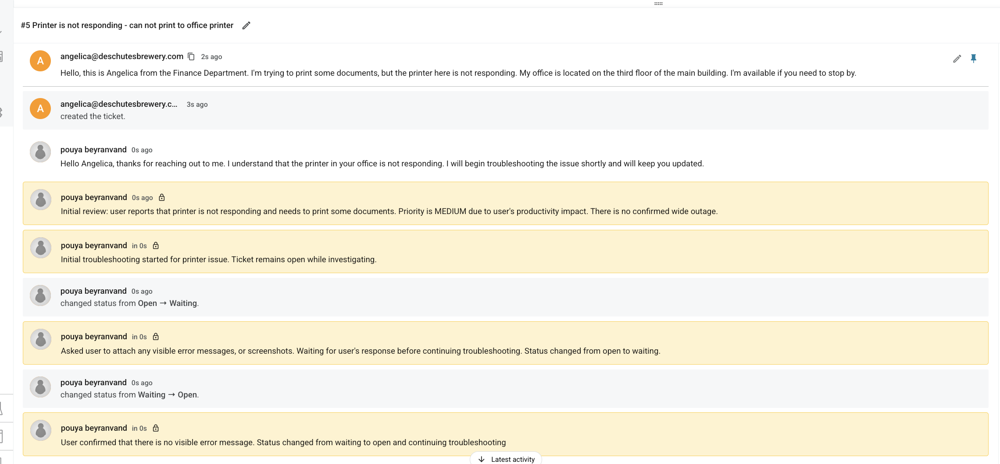
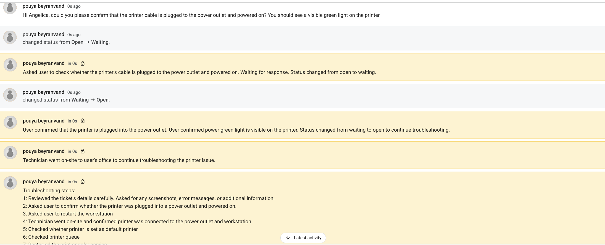
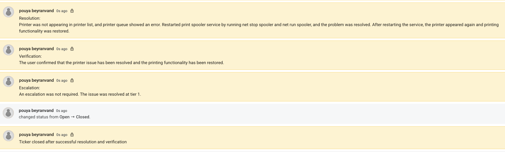

# Lab 03: Printer Not Responding

# How Do I Document Tickets?

When documenting IT support tickets, I follow a clear structure so other IT Technicians can understand the issue, actions taken, and final outcome.

1. Review the ticket details carefully.
   Ask the user for screenshots, error messages, or additional information if needed.

2. Add internal notes after each important step.
   This helps keep the troubleshooting process clear and easy to follow.

3. Document the troubleshooting steps taken.
   Include what was checked, tested, changed, or confirmed.

4. Write the resolution.
   Explain what fixed the issue.

5. Add verification notes.
   Confirm that the user tested the issue and access or service was restored.

6. Add an escalation note.
   State whether escalation was needed or if the issue was resolved at Tier 1.

The goal is to document each ticket clearly so another IT Technician can understand what happened and continue support if needed.

--- 

## Scenario

A user from the Finance Department reported that the office printer was not responding and they could not print documents. The user was located on the third floor of the main building and was available for on-site troubleshooting if needed.

## Tools / Platform

- Ticketing System
- Windows Printer Settings
- Print Queue
- Print Spooler Service
- Command Prompt

## Focus Areas

- Printer troubleshooting
- User communication
- Internal ticket notes
- On-site support documentation
- Print queue troubleshooting
- Print Spooler service restart
- Resolution and verification documentation

## Ticket Summary

Issue: Printer not responding / user cannot print
Category: Printer
Priority: Medium
Impact: User could not print work-related documents
Resolution Level: Tier 1
Escalation: Not required

## Screenshots

## Troubleshooting Steps

1. Reviewed the ticket details carefully.
2. Asked the user for screenshots, error messages, or additional information.
3. Asked the user to confirm whether the printer was plugged into a power outlet and powered on.
4. Asked the user to restart the workstation.
5. Went on-site and confirmed the printer was connected to the power outlet and workstation.
6. Checked whether the printer was set as the default printer.
7. Checked the print queue.
8. Restarted the Print Spooler service.

## Resolution

The printer was not appearing in the printer list, and the print queue showed an error. The Print Spooler service was restarted using command-line troubleshooting.

Commands used:

net stop spooler
net start spooler

After restarting the service, the printer appeared again and printing functionality was restored.

## Verification

The user confirmed that the printer issue was resolved and printing functionality was restored.

## Escalation

An escalation was not required. The issue was resolved at Tier 1.

## Ticket Closure

The ticket was closed after successful resolution and user verification.

## Final Outcome

The printer issue was resolved successfully by restarting the Print Spooler service. The user was able to print documents again, and no escalation was required.

Final Status: Closed
Escalation Required: No
Resolved at: Tier 1
Printing Restored: Yes

## Key Takeaways

- Confirm basic printer power and connection before advanced troubleshooting.
- Ask the user for screenshots or visible error messages when available.
- Check printer status, default printer settings, and the print queue.
- Restarting the Print Spooler service can resolve stuck print jobs or printer visibility issues.
- Always verify with the user before closing the ticket.
